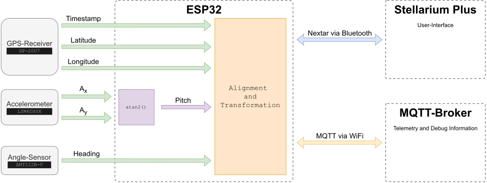

# Upgrading a Dobsonian-Telescope with Push-To Capabilities

This is about retrofitting a [Dobsonian Telescope](https://en.wikipedia.org/wiki/Dobsonian_telescope) with fancy electronics and means to indicate where the telescope is pointing at, to allowing the observer to quickly find an object in the night sky. My motivation was born on a very cold evening shortly after I bought the telescope and I desparately tried to find Uranus in the night sky - and failed.

The resulting setup can, for example, be used with the excellent [Stellarium Plus](https://www.stellarium-labs.com/stellarium-mobile-plus/) App. 

## Introduction

A [Dobsonian Telescope](https://en.wikipedia.org/wiki/Dobsonian_telescope) is a type of telescope that uses an alt-azimuth mounting, which means you can rotate and tilt it. I'm using a [Sky-Watcher 8" Traditional](http://skywatcher.com/product/dob-8-traditional/) but the general method described here can be applied to any Dobsonian.

The term Push-to is generally referred to as a method to indicate (e.g. on a Smartphone-App) where the telescope is pointing at and thus allows to quickly find an object. 

The main design goals are:

1. Precision - I want this setup to be as precise a I can make it with hardware that is available to a hobbyist. 
2. Integration - The solution should integrate with existing astronomy-apps or -software.
3. Simplicity - Setup and installation must match the mobility of a Dobsonian telescope.
4. Wireless - No wires are needed to connect the user interface. Use Wifi or Bluetooth.
5. Ease-of-Use - Anyone should be able to use it with minimal guidance.

## General Concept

To map the current orientation of the telescope to a map of the night sky, we need the following information:

- Date and time
- Location
- Orientation of the telescope

With this information we can transform the orientation of the telescope from a horizontal (alt-azimuth) coordinate system to the equatorial coordinate system that astronomy apps use to indicate the actual position in the night sky where the telescope is pointing at. The critical information with the most influence on the resulting overall precision is the telescope's orientation.

## Overall Design

### Parts List

Part | Description | Datasheet | Price | Source
---|---|---|---|--
ESP32 DEVKIT V1 30-pin | Microcontroller | [ESP-WROOM-32 (30P)](https://github.com/TronixLab/DOIT_ESP32_DevKit-v1_30P) | <10€ | eBay
GP-20U7 | GPS-Receiver | [GP-20U7_Datasheet_v1 2.pdf](docs/GP-20U7_Datasheet_v1 2.pdf) | ~22€ | [Sparkfun](https://www.sparkfun.com/products/13740), [Berrybase](https://www.berrybase.de/en/audio-video/navigation/gps-empf-228-nger-gp-20u7-56-kan-228-le)
LSM6DSOX 6 DoF | Motion Sensor | [LSM6DSOX Datasheet](docs/lsm6dsox.pdf) | 12€ | [Berrybase](https://www.berrybase.de/en/sensors-modules/motion-distance/adafruit-lsm6dsox-6-dof-beschleugnigunssensor-und-gyroskop)
SD-Card Case | Housing for Motion Sensor | n/a | n/a | you will have one of these lying around
AMT222B-V | Angle Sensor | [AMT22-V Kit ](https://www.cuidevices.com/product/motion/rotary-encoders/absolute/modular/amt22-v-kit) | 50€ | [Mouser](https://eu.mouser.com/ProductDetail/CUI-Devices/AMT222B-V?qs=l7cgNqFNU1jQeqcgztT9Sw%3D%3D)
Molex 502578-0600 | Crimp-Housing for AMT22 | [CLIK-Mate Plug Housing](https://www.molex.com/molex/products/part-detail/crimp_housings/5025780600) | <1€ | [Mouser](https://eu.mouser.com/ProductDetail/Molex/502578-0600?qs=3OKVfsn1b5Ax%252B4TT0aiBNw%3D%3D)
Molex 79758-1011 | Cable Assembly for Crimp-Housing | [Pre-Crimped Lead CLIK-Mate](https://www.molex.com/molex/products/part-detail/cable_assemblies/0797581011) | 1€ | [Farnell](https://de.farnell.com/en-DE/molex/79758-1011/cable-assy-crimp-skt-skt-black/dp/3107351?CMP=i-ddd7-00001003)
Housing Raspberry Pi Zero | Housing for µC and GPS-Receiver | n/a | 4€ | [Berrybase](https://www.berrybase.de/en/raspberry-pi/raspberry-pi-computer/housing/for-raspberry-pi-zero/geh-228-use-gpio-referenz-f-252-r-raspberry-pi-zero?c=314)
SparkFun Qwiic 500mm | Connector Cable | [Flexible Qwiic Cable - 500mm](https://www.sparkfun.com/products/17257) | 2€ | [Sparkfun](https://www.sparkfun.com/products/17257), [Berrybase](https://www.berrybase.de/en/sensors-modules/adafruit-stemma-qt-sparkfun-qwiic/cables/sparkfun-qwiic-flexibles-kabel-500mm)
Micro-USB Cable | Power Supply | n/a | <5€ | Amazon
USB-Power Bank | Power Supply | n/a | 15€+ | Amazon
Hook/Loop Fastener with Adhesive | Attach housings to telescope base | n/a | 5€ | Hardware store
Teflon Sealant Tape | Reduce tolerances | n/a | <5€ | Hardware Store
POM Plastic Sheet 6mm | Attach Angle Sensor | n/a | 10€ | Hardware Store
Steel Rod 25mm diameter | Attach Angle Sensor | n/a | 20€ | Hardware Store
various Fasteners | Parts assembly | n/a | <10€ | Hardware Store

## Hardware Design

## Mechanical Construction

## Software

## User Interface